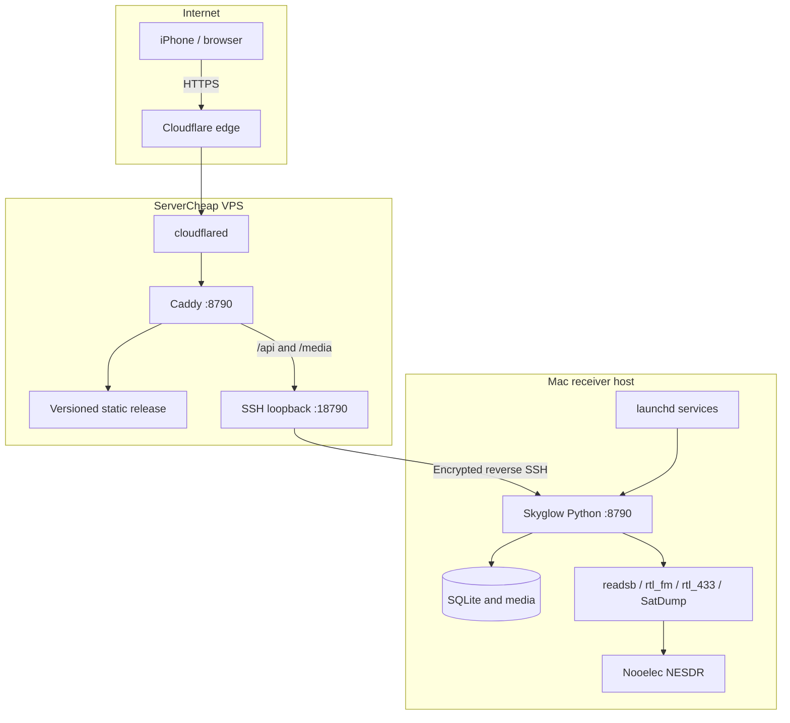
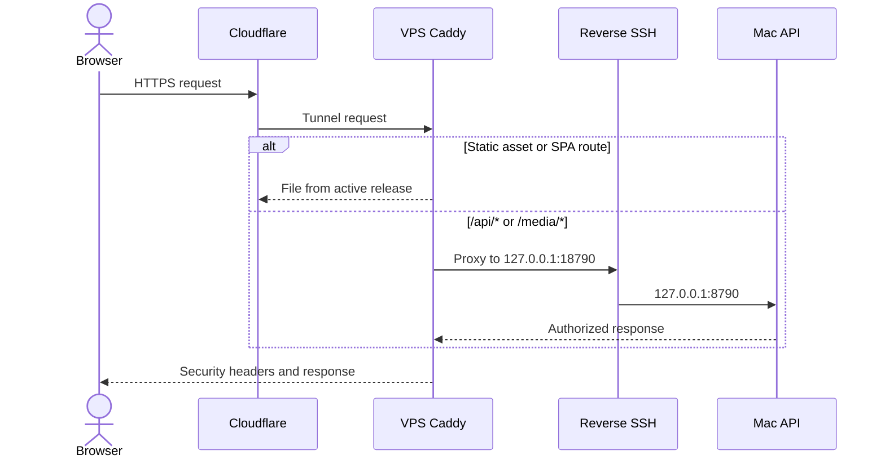
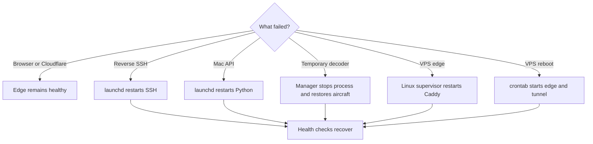

# Architecture

Skyglow separates public web delivery from physical radio control. The VPS serves static assets and terminates the Cloudflare origin path. The Mac keeps the receiver, credentials, history, recordings, and decoders.

## Deployment topology

Both VPS listeners are bound to loopback. The Mac opens the SSH connection outward, so the home network needs no inbound port or router rule.

## Request routing

## Components

| Component               | Runs on         | Responsibility                                                          |
| ----------------------- | --------------- | ----------------------------------------------------------------------- |
| Next/Vinext client      | VPS and browser | Responsive application shell, map, controls, audio, and replay UI       |
| Caddy edge              | VPS             | Static files, compression, security headers, and API/media proxy        |
| cloudflared             | VPS             | Public HTTPS path without opening VPS web ports directly                |
| Reverse SSH LaunchAgent | Mac             | Persistent encrypted loopback path to the VPS                           |
| Python receiver service | Mac             | Authentication, APIs, history, scheduling, decoder lifecycle, and media |
| SQLite and media tree   | Mac             | Positions, alerts, sensors, captures, account, and recordings           |
| Decoder tools           | Mac             | Demodulation and decoding for the active receiver mode                  |

## Recovery behavior

The interface can still load from the VPS when the Mac is unavailable, but login, live data, media, and controls depend on the private receiver path.
