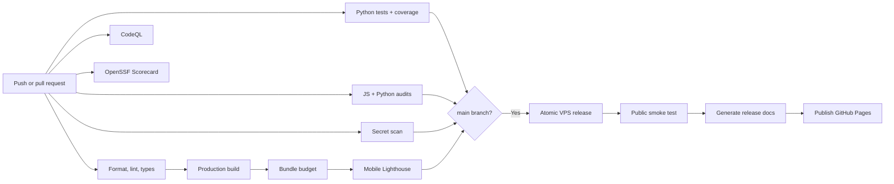
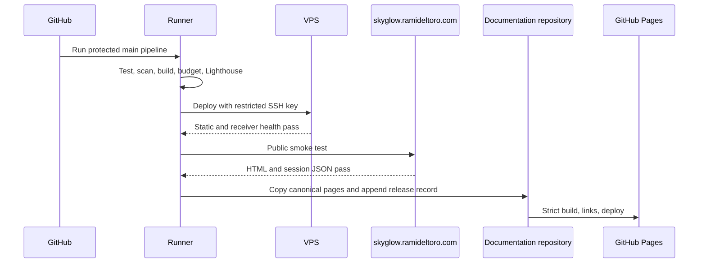

# CI/CD and automatic documentation

Every push and pull request uses the same quality gates. Only a successful `main` run can deploy. Production then receives the exact build artifact that passed the earlier stages.

## Pipeline graph

## Required gates

| Stage                                      | Protects                                                        |
| ------------------------------------------ | --------------------------------------------------------------- |
| Formatting and linting                     | Review clarity and common JavaScript/TypeScript mistakes        |
| Type check                                 | Component, API, and data-shape contracts                        |
| Python unit tests and branch coverage      | Authentication, bounds, replay, paths, and receiver behavior    |
| Dependency audits and PR dependency review | Known vulnerable package versions and risky upgrades            |
| Gitleaks plus GitHub push protection       | Credentials accidentally entering history                       |
| CodeQL                                     | JavaScript/TypeScript and Python data-flow vulnerabilities      |
| OpenSSF Scorecard                          | Repository and supply-chain hygiene                             |
| Production build                           | Reproducible deployable assets from the lockfile                |
| Bundle budget                              | iPhone payload growth beyond explicit raw and gzip limits       |
| Lighthouse                                 | Performance, accessibility, best practices, and SEO regressions |
| Atomic deploy and smoke test               | Broken configuration, missing assets, or receiver path failure  |
| Documentation sync                         | Wiki pages and release history matching deployed behavior       |

## Release sequence

The production SSH key is separate from the Mac’s operational key and has forwarding and interactive access disabled. The wiki uses a different deploy key that can write only to the documentation repository. GitHub-hosted secrets are never written to release archives.

## Automatic release notes

After the public smoke test succeeds, `ops/sync_wiki.py` copies `wiki/skyglow` into the shared documentation site and generates:

- the exact deployed commit and workflow run;
- commit messages since the previous documented release;
- changed paths grouped into interface, receiver, operations, documentation, dependencies, tests, or project configuration;
- a deduplicated release-history row linking back to GitHub.

If production fails, documentation is not advanced to an undeployed commit.
