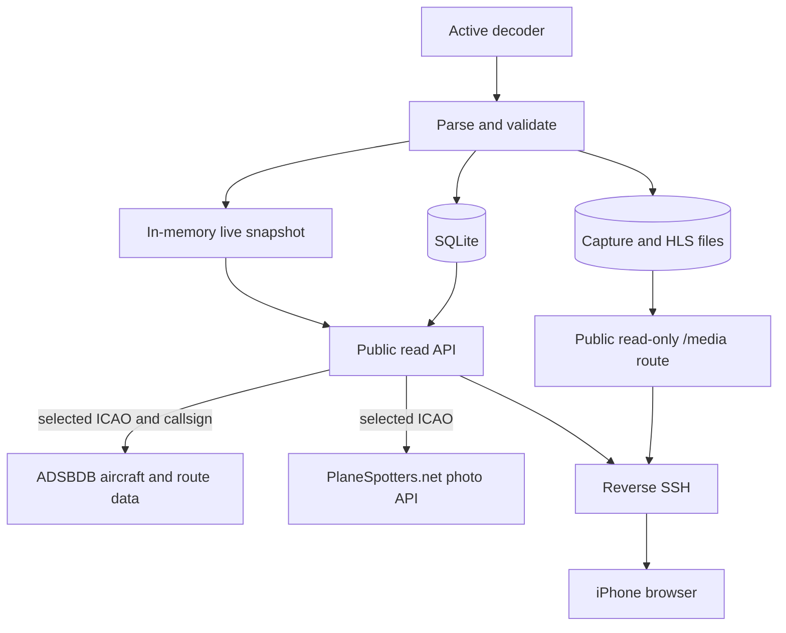
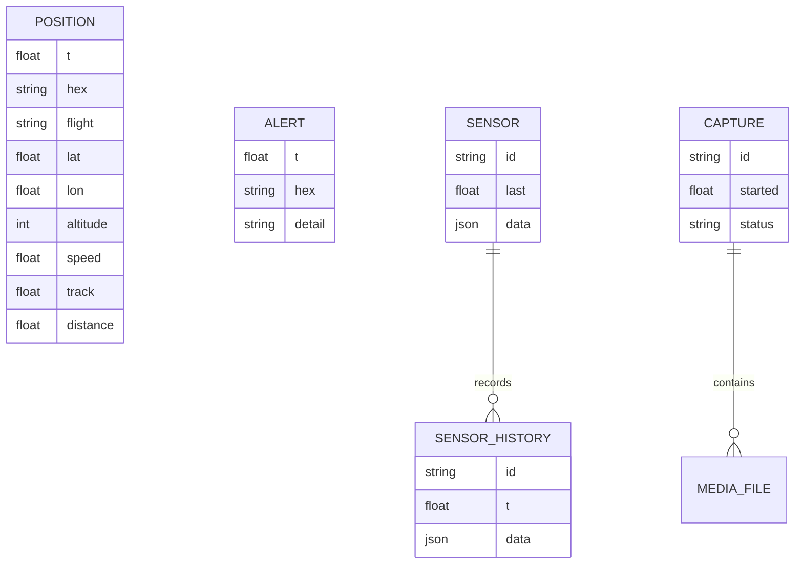
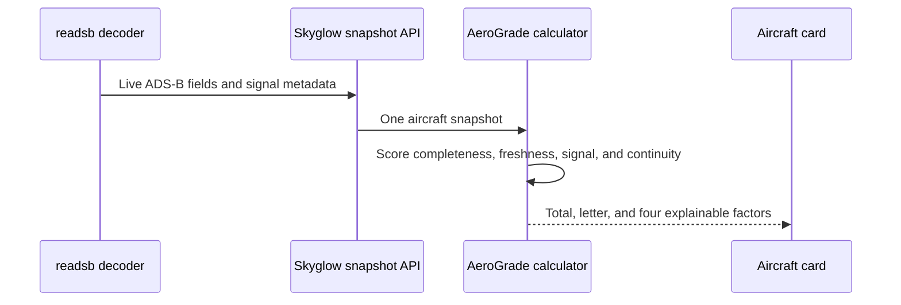

# Data and API

Skyglow keeps receiver data on the Mac and publishes a read-only view through the portal. The VPS stores only versioned static web assets; it does not contain the account database, aircraft archive, recordings, or station settings. Owner authentication is required for hardware changes and private diagnostics.

## Data flow

## Stored relationships

## Retention

| Data                    | Retention                                          | Notes                                                                                 |
| ----------------------- | -------------------------------------------------- | ------------------------------------------------------------------------------------- |
| Aircraft positions      | 7 days                                             | Replay samples one point per aircraft per minute and caps a response at 60,000 points |
| Range record            | Persistent                                         | Best observed range survives normal history cleanup                                   |
| Sensor history          | 7 days stored; latest 24 hours returned per sensor | Bounded to 150 recent readings per request                                            |
| Satellite capture files | 30 days                                            | Only actual decoder output is shown                                                   |
| Receiver log excerpt    | Current local file                                 | API returns only the most recent bounded text                                         |
| Login sessions          | 30 days maximum                                    | Stored as token hashes and individually revocable                                     |

## HTTP routes

| Method | Route                      | Purpose                                                | Authentication                    |
| ------ | -------------------------- | ------------------------------------------------------ | --------------------------------- |
| GET    | `/api/session`             | Report whether the current cookie is an owner session  | Public                            |
| POST   | `/api/login`               | Create a `sqwak` owner session                         | Host/Origin checks and rate limit |
| POST   | `/api/logout`              | Revoke the current browser session                     | Valid Origin                      |
| GET    | `/api/snapshot`            | Live receiver, aircraft, alerts, sensors, and captures | Public, read-only                 |
| GET    | `/api/aircraft-details`    | Cached aircraft identity, route, and attributed photo  | Public, read-only                 |
| GET    | `/api/aircraft-thumbnails` | Cached thumbnails for nearby aircraft and alerts       | Public, read-only                 |
| GET    | `/api/replay`              | Bounded aircraft history for a time range              | Public, read-only                 |
| GET    | `/api/sensor-history`      | Recent readings for one sensor                         | Public, read-only                 |
| GET    | `/api/receiver-log`        | Bounded diagnostic tail                                | Owner                             |
| GET    | `/api/push-key`            | Web Push public key                                    | Owner                             |
| POST   | `/api/mode`                | Change or stop a receiver mode                         | Owner                             |
| POST   | `/api/settings`            | Update validated station settings                      | Owner                             |
| POST   | `/api/push`                | Add or remove an approved push endpoint                | Owner                             |
| GET    | `/media/*`                 | Current HLS audio segments and capture products        | Public, read-only                 |

## Aircraft enrichment

Aircraft cards and list thumbnails combine two kinds of information:

- **Live broadcast data** comes directly from the local antenna, including altitude, ground speed, heading, vertical rate, squawk, navigation selections, signal strength, and position age.
- **Reference data** comes from ADSBDB and PlaneSpotters.net, including registration, model, operator, route, airports, and an attributed aircraft photo when one is available.

Skyglow sends only ICAO addresses and selected callsigns to these services. Aircraft identity responses are cached for seven days, routes for six hours, and photo lookups for one day. One bounded thumbnail request covers the currently displayed nearby and alert rows. Failed lookups use a five-minute cache so an unavailable provider cannot delay every refresh. Returned image and attribution links must use an allowlisted HTTPS host.

## AeroGrade methodology

AeroGrade is calculated in the browser from one aircraft’s current receiver snapshot. It is deterministic, has no paid API dependency, and exposes all four component scores in the interface. The maximum weights are telemetry 40, reception 25, identity 20, and continuity 15. Score bands are A+ at 90, A at 80, B+ at 70, B at 60, C at 50, and D below 50.

The score deliberately excludes claims the available data cannot support:

- The [FAA releasable aircraft database](https://www.faa.gov/licenses_certificates/aircraft_certification/aircraft_registry/releasable_aircraft_download) is refreshed daily and can provide U.S. registry facts, but it is not a maintenance or condition history. Its [field documentation](https://registry.faa.gov/database/ardata.pdf) explains fields such as year manufactured and airworthiness certificate data.
- The [NTSB accident-data page](https://www.ntsb.gov/safety/data/Pages/Data_Stats.aspx) and [CAROL search](https://carol.ntsb.gov/) provide official investigation records. Skyglow links to them as research sources and does not turn record presence or absence into a safety score.
- Lifetime flight hours, cycles, maintenance findings, and airframe mileage require operator or maintenance records that are not available in the receiver snapshot.

Published route mileage is calculated only when ADSBDB supplies coordinates for both airports. Skyglow uses the great-circle distance and labels it as route context; it does not include that distance in AeroGrade.

## Replay sampling

Inputs are range checked, JSON bodies are size limited, filesystem paths are confined to the expected roots, and JSON serialization rejects non-finite numbers.
