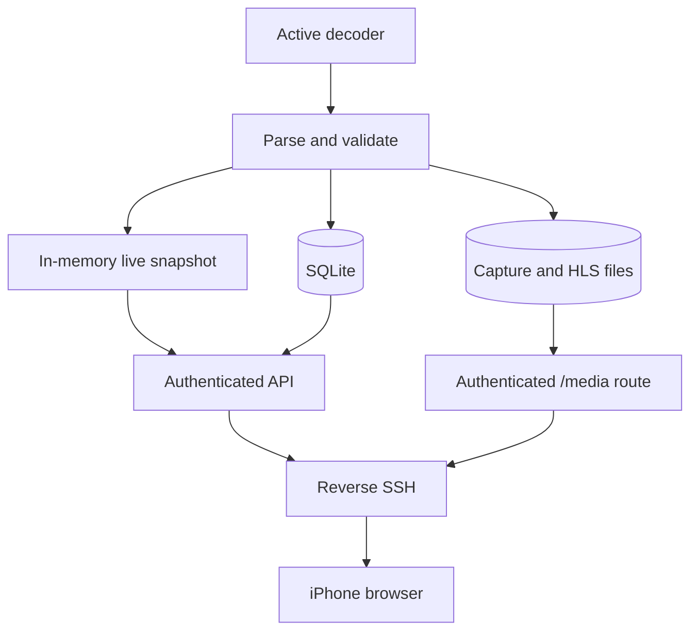
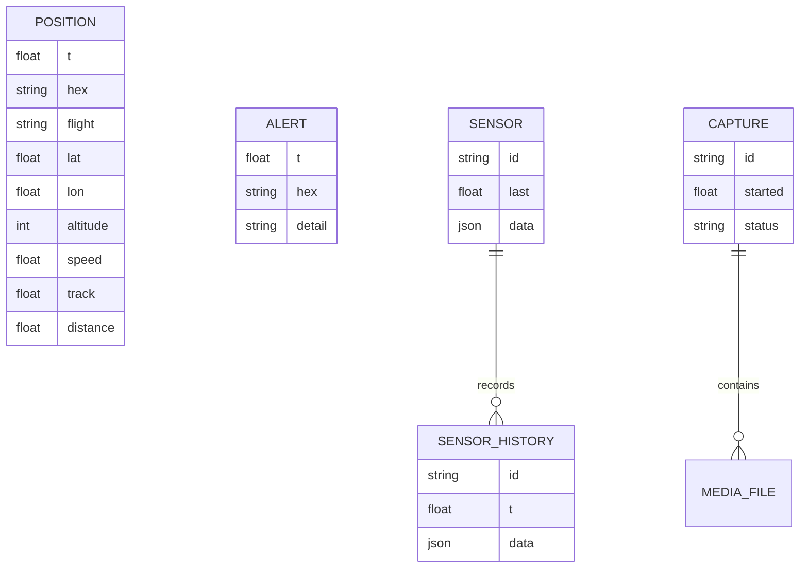
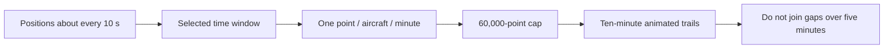

# Data and API

Skyglow keeps private receiver data on the Mac. The VPS stores only versioned static web assets; it does not contain the account database, aircraft archive, recordings, or precise station settings.

## Data flow

## Stored relationships

## Retention

| Data                    | Retention                                          | Notes                                                                                 |
| ----------------------- | -------------------------------------------------- | ------------------------------------------------------------------------------------- |
| Aircraft positions      | 7 days                                             | Replay samples one point per aircraft per minute and caps a response at 60,000 points |
| Range record            | Persistent                                         | Best observed range survives normal history cleanup                                   |
| Sensor history          | 7 days stored; latest 24 hours returned per sensor | Bounded to 150 recent readings per request                                            |
| Satellite capture files | 30 days                                            | Only actual decoder output is shown                                                   |
| Receiver log excerpt    | Current local file                                 | API returns only the most recent bounded text                                         |
| Login sessions          | 30 days maximum                                    | Stored as token hashes and individually revocable                                     |

## HTTP routes

| Method | Route                 | Purpose                                                       | Authentication                    |
| ------ | --------------------- | ------------------------------------------------------------- | --------------------------------- |
| GET    | `/api/session`        | Report whether the current cookie is valid                    | Public response, no private data  |
| POST   | `/api/login`          | Create a browser session                                      | Host/Origin checks and rate limit |
| POST   | `/api/logout`         | Revoke the current session                                    | Valid Origin                      |
| GET    | `/api/snapshot`       | Live receiver, aircraft, alerts, tools, sensors, and captures | Required                          |
| GET    | `/api/replay`         | Bounded aircraft history for a time range                     | Required                          |
| GET    | `/api/sensor-history` | Recent readings for one sensor                                | Required                          |
| GET    | `/api/receiver-log`   | Bounded diagnostic tail                                       | Required                          |
| GET    | `/api/push-key`       | Web Push public key                                           | Required                          |
| POST   | `/api/mode`           | Change or stop a receiver mode                                | Required                          |
| POST   | `/api/settings`       | Update validated station settings                             | Required                          |
| POST   | `/api/push`           | Add or remove an approved push endpoint                       | Required                          |
| GET    | `/media/*`            | HLS segments and capture products                             | Required                          |

## Replay sampling

Inputs are range checked, JSON bodies are size limited, filesystem paths are confined to the expected roots, and JSON serialization rejects non-finite numbers.
