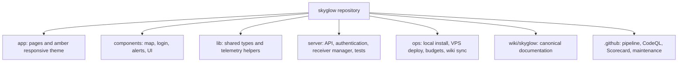
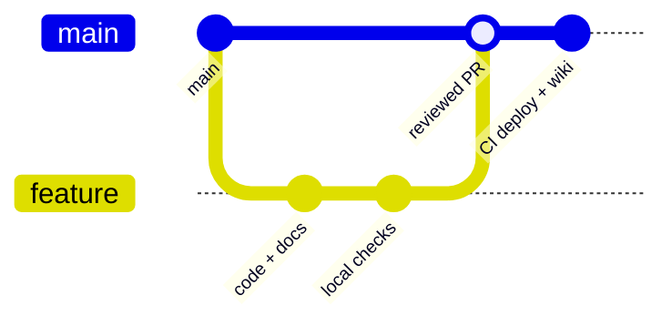

# Development

## Repository map



## Local checks

Requirements are Node.js 22 or newer, pnpm 11.19.0, Python 3.12 for CI parity, and the receiver dependencies listed in `server/requirements.txt`.

```bash
corepack enable
corepack prepare pnpm@11.19.0 --activate
pnpm install --frozen-lockfile
python3 -m venv .venv
. .venv/bin/activate
pip install -r requirements-dev.txt
pnpm check
pnpm test
pnpm build
pnpm bundle:check
```

The tests use temporary state and mocked processes, so they do not retune the physical SDR. Real receiver handoffs should be verified deliberately after the automated suite passes.

## Change flow



1. Branch from `main` and keep code and documentation together.
2. Preserve authentication on private routes and POST-only receiver controls.
3. Keep mode durations, response sizes, paths, and numeric inputs bounded.
4. Add focused tests for security boundaries, state transitions, or bug regressions.
5. Update the canonical wiki when behavior, deployment, data, security, or operations change.
6. Open a pull request and wait for required checks and code-owner review.

## Documentation preview

The Skyglow pages are published inside the shared Antenna Observatory MkDocs site. To preview the complete navigation, synchronize a local clone and run MkDocs:

```bash
python3 ops/sync_wiki.py ../antenna_observatory_wiki
cd ../antenna_observatory_wiki
python3 -m venv .venv
. .venv/bin/activate
pip install -r requirements.txt
mkdocs serve
```

The documentation build uses strict warnings and checks links before GitHub Pages deployment.
