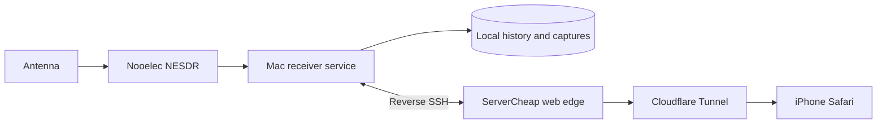
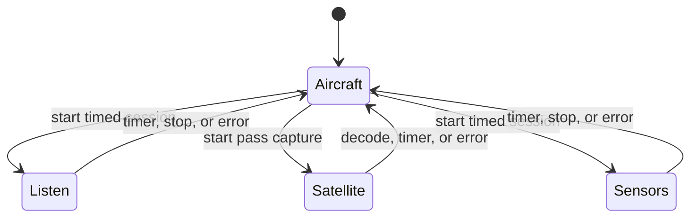

# Skyglow

Multi-band · mobile radio observatory

Skyglow turns one software-defined radio attached to a Mac into a private observatory for aircraft, radio audio, weather satellites, and nearby wireless sensors. The interface is designed around iPhone Safari and is available at [skyglow.ramideltoro.com](https://skyglow.ramideltoro.com).

[Open Skyglow](https://skyglow.ramideltoro.com){ .md-button .md-button--primary }
[Browse the source](https://github.com/ramideltoro/skyglow){ .md-button }

## What it can do

- :material-airplane:{ .lg .middle } **Watch aircraft**

  ***

  Plot nearby aircraft, altitude, speed, direction, signal age, and range records from local 1090 MHz reception.

  [:octicons-arrow-right-24: Use Skyglow](use.md)

- :material-history:{ .lg .middle } **Replay the sky**

  ***

  Review seven days of sampled tracks and animate ten-minute trails without joining long reception gaps.

  [:octicons-arrow-right-24: Data and API](data-api.md)

- :material-radio:{ .lg .middle } **Hear nearby signals**

  ***

  Listen to aircraft AM or NOAA weather FM through iPhone-compatible AAC HLS audio.

  [:octicons-arrow-right-24: Receiver modes](receiver-modes.md)

- :material-satellite-variant:{ .lg .middle } **Capture and discover**

  ***

  Schedule supported Meteor LRPT captures or decode compatible wireless sensors with SatDump and rtl_433.

  [:octicons-arrow-right-24: Receiver modes](receiver-modes.md)

## The central constraint

One physical receiver can tune one band at a time. Aircraft collection pauses during Listen, Satellite, or Sensors and resumes automatically when the session ends. Replay and previously saved results remain available in every mode.

## Documentation map

| Need                             | Start here                                                            |
| -------------------------------- | --------------------------------------------------------------------- |
| Open the app on an iPhone        | [Using Skyglow](use.md)                                               |
| Understand the VPS and Mac split | [Architecture](architecture.md)                                       |
| Choose a frequency or decoder    | [Receiver modes](receiver-modes.md)                                   |
| Understand storage and endpoints | [Data and API](data-api.md)                                           |
| Recover a failed service         | [Operations](operations.md) and [Troubleshooting](troubleshooting.md) |
| Review safeguards                | [Security](security.md)                                               |
| Understand releases              | [CI/CD](ci-cd.md) and [Current release](project/current-release.md)   |
