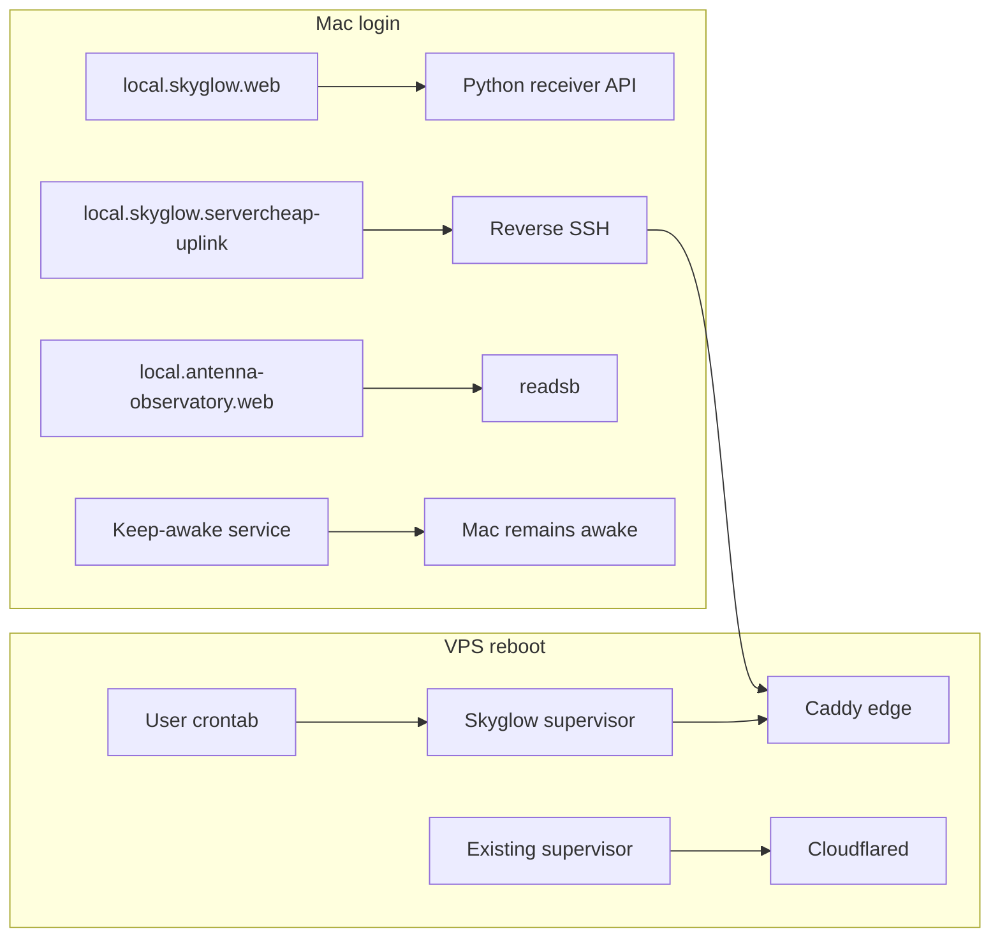
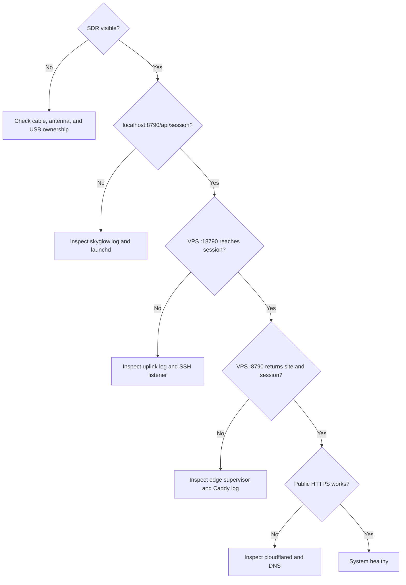
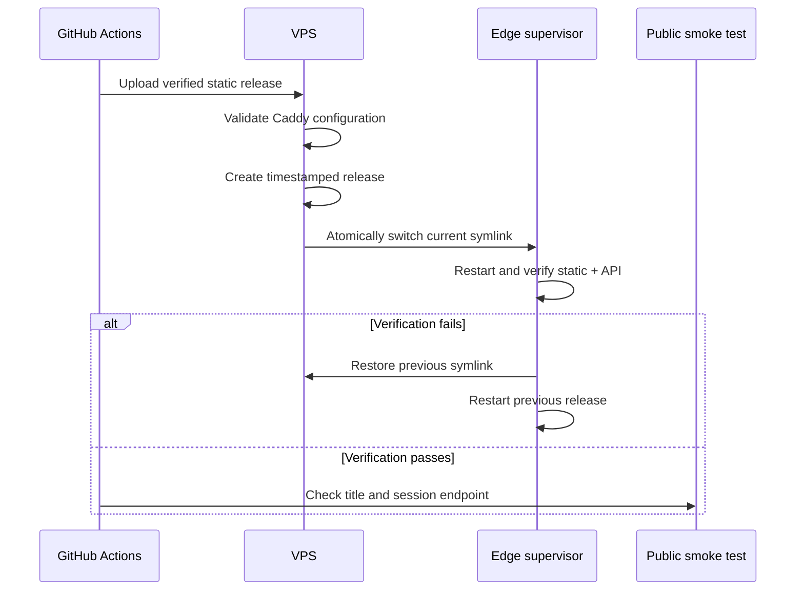

# Operations

## Service lifecycle



## Health ladder

Check from the physical receiver outward. Each successful step narrows the failure to the next link.



| Check           | Command                                                                                        |
| --------------- | ---------------------------------------------------------------------------------------------- |
| Mac service     | `launchctl print gui/$(id -u)/local.skyglow.web`                                               |
| Mac API         | `curl http://127.0.0.1:8790/api/session`                                                       |
| SSH uplink      | `launchctl print gui/$(id -u)/local.skyglow.servercheap-uplink`                                |
| VPS ports       | `ssh 65.75.201.18 'ss -ltn                                                                     | grep -E ":(8790 | 18790)"'` |
| VPS API path    | `ssh 65.75.201.18 'curl -H "Host: skyglow.ramideltoro.com" http://127.0.0.1:8790/api/session'` |
| Public API path | `curl https://skyglow.ramideltoro.com/api/session`                                             |

## Deployment and rollback



Every release is stored under `~/skyglow/releases` on the VPS. `~/skyglow/current` points to the active release. The installer records the previous target and restores it if either the static page or the receiver API fails locally.

Manual recovery uses the same reviewed deployer:

```bash
pnpm build
python3 ops/servercheap/deploy.py 65.75.201.18
```

## Logs and state

| Location                                        | Content                                               |
| ----------------------------------------------- | ----------------------------------------------------- |
| `~/Library/Logs/skyglow.log`                    | Mac API, mode manager, and decoder messages           |
| `~/Library/Logs/skyglow-servercheap-uplink.log` | Persistent SSH tunnel errors                          |
| `~/Library/Application Support/Skyglow/state`   | Private settings, database, sessions, media, and logs |
| `~/.local/state/skyglow/edge.log` on VPS        | User Caddy edge and supervisor output                 |
| `~/.local/share/skyglow` on VPS                 | Supervisor lock and PID state                         |

Never paste unredacted account files, session stores, private coordinates, tunnel tokens, or radio recordings into an issue.
