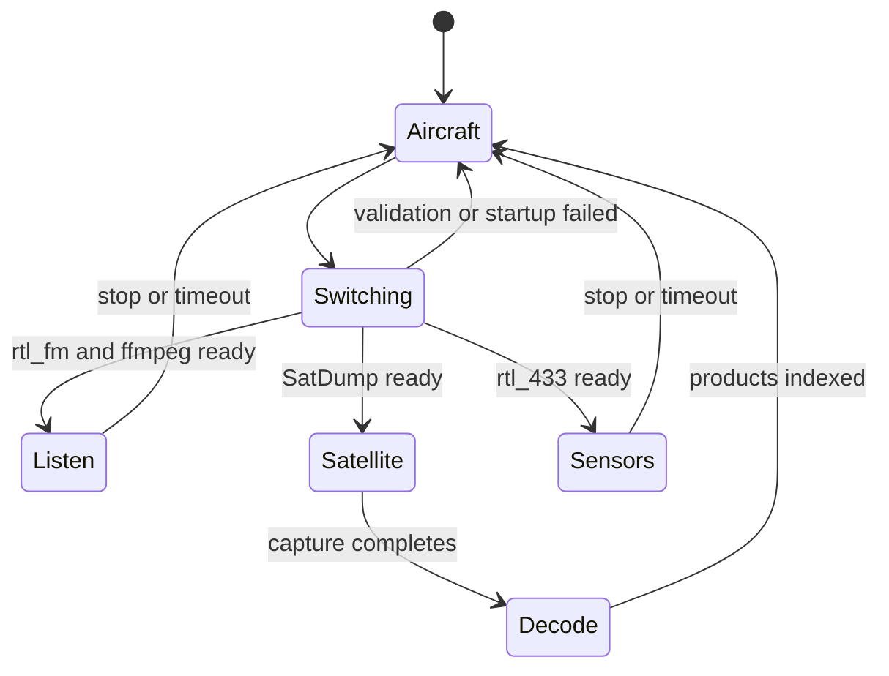
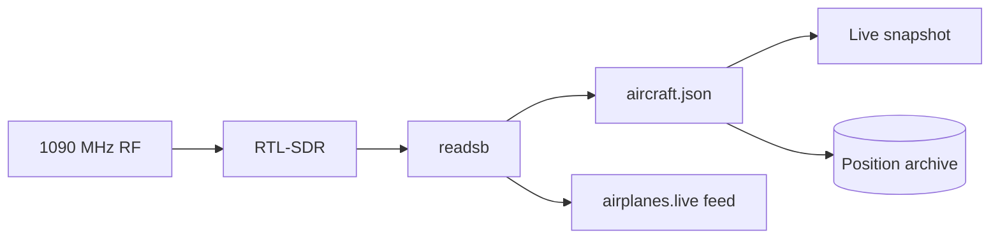
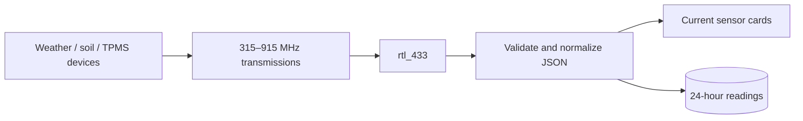
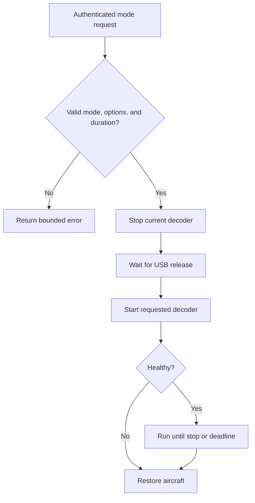

# Receiver modes

The receiver manager owns one exact USB SDR and serializes every mode change. A failed startup stops partial processes and restores aircraft reception.

## Aircraft

- Frequency: **1090 MHz** ADS-B and Mode S.
- Local JSON is sampled every two seconds; recent positioned aircraft are archived about every ten seconds.
- The Live map uses OpenStreetMap tiles and requires no commercial map key.
- Aircraft mode is the default and the recovery target for every temporary session.

## Listen

| Source             | Range               | Modulation | Useful starting point                                       |
| ------------------ | ------------------- | ---------- | ----------------------------------------------------------- |
| Aircraft voice     | 118.000–136.975 MHz | AM         | An active Tampa tower, approach, departure, or ATIS channel |
| NOAA Weather Radio | 162.400–162.550 MHz | FM         | 162.550 MHz in Tampa                                        |

Audio is live with a small HLS buffer. Every tune resets the playlist and uses unique segment names so Safari cannot replay segments from the previous frequency.

## Satellite

- Intended for supported Meteor M2-series LRPT around 137 MHz.
- Prediction uses refreshed CelesTrak orbital elements and rejects stale data.
- Capture duration is bounded and aircraft mode returns after processing.
- Real imagery requires the active satellite frequency and symbol rate, a suitable 137 MHz antenna, an open sky view, and a usable pass.

## Sensors

Selectable bands include 315, 345, 433.92, 868.3, and 915 MHz. Only protocols implemented by the installed rtl_433 version can be decoded. Many battery sensors transmit only periodically or after a value changes.

## Mode ownership rules

All receiver changes use authenticated POST requests. GET requests never change receiver state.
