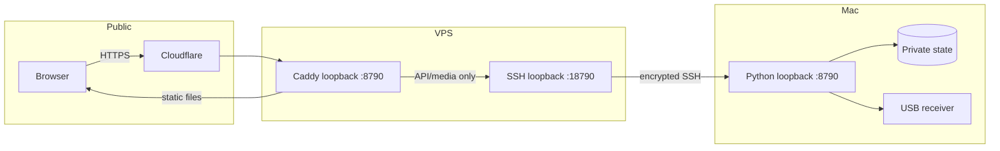
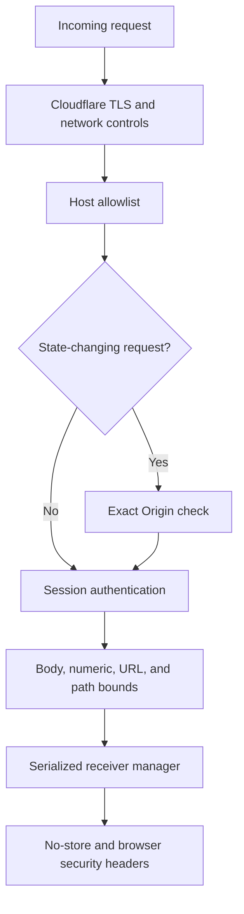

# Security

Skyglow treats live positions, receiver coordinates, history, sensor readings, audio, captures, logs, settings, and radio controls as private data.

## Trust boundaries



No receiver API port is exposed on the home router or VPS public interface. The Mac initiates the SSH tunnel and launchd reconnects it after interruption.

## Login flow

```mermaid
sequenceDiagram
    actor User
    participant Browser
    participant Edge as VPS edge
    participant API as Mac API
    participant Store as Login store
    User->>Browser: Submit credentials
    Browser->>Edge: POST /api/login + Origin
    Edge->>API: Reverse SSH proxy
    API->>API: Validate Host, Origin, size, and rate limit
    API->>Store: PBKDF2-SHA256 comparison
    Store-->>API: New random session token
    API-->>Browser: HttpOnly; Secure; SameSite=Strict cookie
    Browser->>API: Authenticated API request
    API->>Store: Compare SHA-256 token hash and expiry
    Store-->>Browser: Private response
```

The password itself is never stored. Account setup saves a per-account random salt, 600,000 PBKDF2-SHA256 iterations, and the resulting hash. Session files contain hashes of random browser tokens rather than reusable token values.

## Defense layers



| Control                    | Purpose                                                                              |
| -------------------------- | ------------------------------------------------------------------------------------ |
| Login throttling           | Ten failed attempts from one client in five minutes trigger a temporary limit        |
| Host and Origin allowlists | Reject cross-site control submissions and unexpected hostnames                       |
| Secure session cookie      | Prevent JavaScript access, cross-site sending, and plaintext public transport        |
| POST-only controls         | Prevent links, crawlers, and cached GET requests from changing hardware state        |
| Path confinement           | Prevent media and static routes from escaping their configured roots                 |
| Push URL allowlist         | Limit subscriptions to Apple, Google, and Mozilla push services                      |
| Private loopback links     | Keep the Mac API and VPS receiver port off public interfaces                         |
| Dedicated CI keys          | Separate production and wiki credentials; no owner token is stored in the repository |
| Pinned Actions             | CI references reviewed action commits and Dependabot proposes updates                |

## Repository security

Pull requests run formatting, linting, type checks, receiver tests, dependency review, dependency audits, secret scanning, CodeQL, a production build, bundle budgets, and Lighthouse. GitHub secret scanning and push protection reject supported credential patterns. See the repository [security policy](https://github.com/ramideltoro/skyglow/security/policy) for private reporting.
