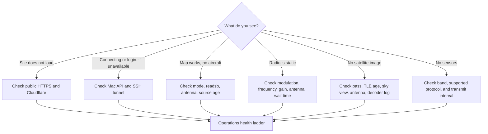
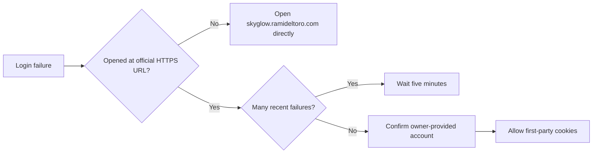

# Troubleshooting

## Start with the symptom

## Site loads but stays on Connecting

1. Request `https://skyglow.ramideltoro.com/api/session`. It should return JSON.
2. On the Mac, check `local.skyglow.web` and `http://127.0.0.1:8790/api/session`.
3. Check `local.skyglow.servercheap-uplink` and its log.
4. On the VPS, confirm loopback listeners on 8790 and 18790.

An interface-only response means Caddy and Cloudflare are healthy; missing session JSON points to the private Mac path.

## Login fails

Do not reset the account through a public endpoint. Account creation and password changes are local administrative operations.

## Aircraft are missing or stale

- Return the receiver to **Aircraft** mode.
- Confirm the USB receiver is not held by rtl_fm, rtl_433, or SatDump.
- Inspect the source-age value and readsb LaunchAgent.
- Check the antenna and coax connection, then compare the receiver diagnostics site.
- Remember that aircraft without recent positions cannot be plotted on the map.

## Radio audio is only static

- Use AM for aircraft voice and FM for NOAA weather.
- Test Tampa NOAA at 162.550 MHz to establish whether the receiver and audio path work.
- Aircraft channels can remain quiet for minutes; wait for actual traffic.
- Extend the telescopic antenna vertically near a window and move it away from digital noise.
- Try a nearby published tower, approach, departure, ground, or ATIS frequency.

## Satellite capture has no image

A completed timer does not guarantee a decodable image. Confirm a supported satellite was transmitting, the selected frequency and symbol rate matched, the pass rose above the configured elevation, and a suitable 137 MHz antenna had a clear view. Review the receiver log for synchronization and CADU counts.

## Sensor mode finds nothing

Confirm the device actually transmits, choose its regional band, and wait through several transmission intervals. Check the rtl_433 supported-device list for the exact model. A receiver can hear energy from an unsupported protocol without producing a decoded sensor card.

See the [operations runbook](operations.md) for service commands, logs, deployment rollback, and the complete health ladder.
