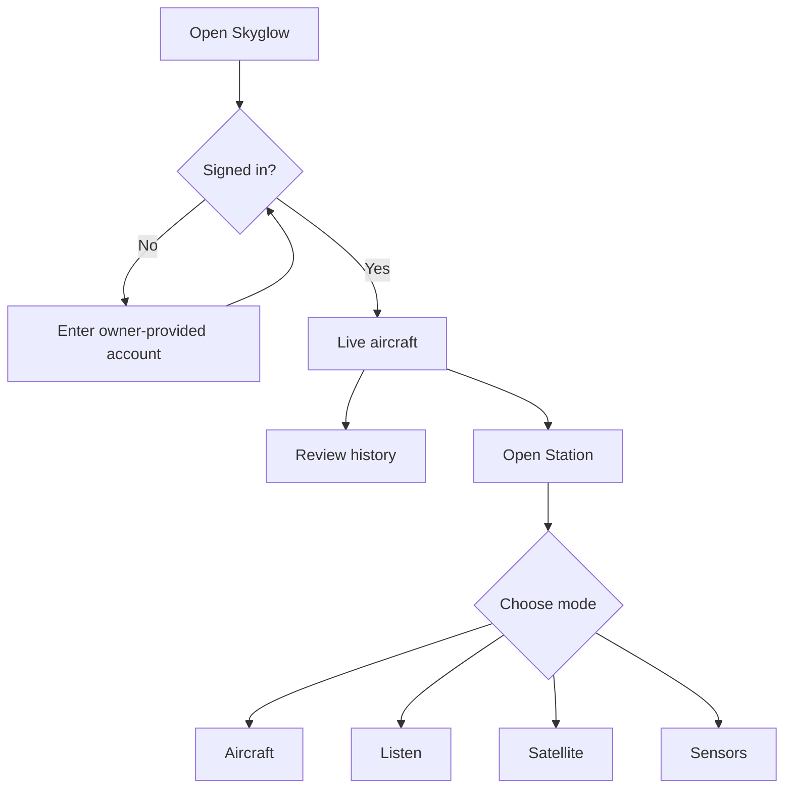
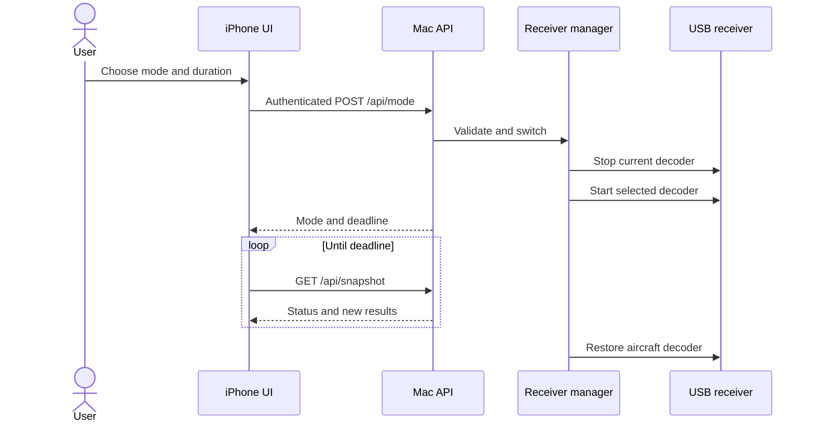

# Using Skyglow

## Open it on iPhone

1. Visit [skyglow.ramideltoro.com](https://skyglow.ramideltoro.com) in Safari.
2. Sign in with the account provided by the owner.
3. Open Safari’s **Share** menu and choose **Add to Home Screen**.
4. Launch the saved app. In **Station**, enable phone alerts if desired.

The Home Screen experience supports safe-area insets, 48-pixel controls, a fixed mobile navigation pattern, native audio controls, dark amber styling, and reduced-motion preferences.

## Main areas

| Area           | Purpose                                                                         |
| -------------- | ------------------------------------------------------------------------------- |
| **Live**       | Current aircraft, map, range, altitude, direction, and overhead alerts          |
| **Replay**     | Saved positions, day selection, animated trails, and records                    |
| **Station**    | Receiver status, installed tools, account controls, notifications, and sign out |
| **Mode sheet** | Start a timed radio, satellite, or sensor session; return to aircraft           |

## A receiver session

!!! warning "Aircraft history pauses"
Aircraft broadcasts cannot be archived while the single receiver is tuned to another band.

## Listening tips

- Safari requires a tap on the native audio control before playing sound.
- Aircraft voice uses AM and is intermittent. Try an active airport frequency and wait through quiet intervals.
- Tampa NOAA weather at **162.550 MHz FM** is the initial signal-check preset.
- Place the telescopic antenna vertically near a window and move it away from chargers, displays, and USB noise.
- Stop the session or let its timer expire to return to aircraft reception.

## Alerts and privacy

Overhead alerts can sound while the page is open. iOS web push requires an iPhone Home Screen installation and iOS 16.4 or later. All aircraft details, audio, captures, settings, and logs require login. Signing out revokes only the current browser session.
