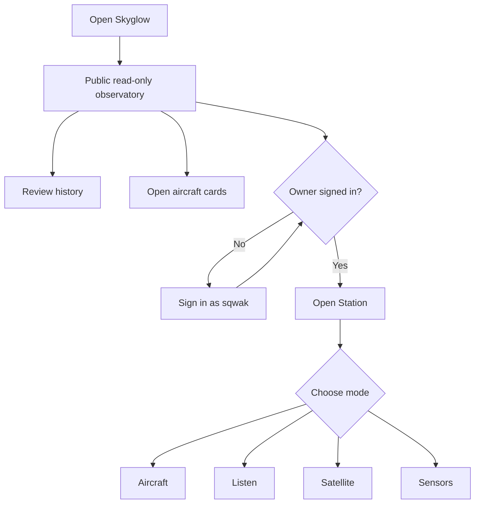
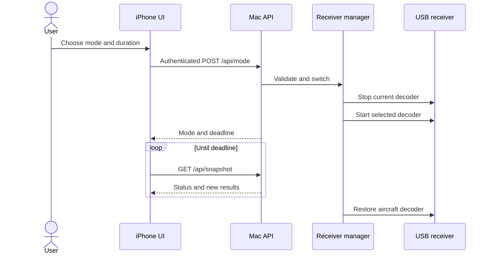

# Using Skyglow

## Open it on iPhone

1. Visit [skyglow.ramideltoro.com](https://skyglow.ramideltoro.com) in Safari.
2. Explore the live sky and saved observations without signing in.
3. Open Safari’s **Share** menu and choose **Add to Home Screen**.
4. The owner can choose **Owner sign in**, authenticate as `sqwak`, and enable phone alerts in **Station**.

The Home Screen experience supports safe-area insets, 48-pixel controls, a fixed mobile navigation pattern, native audio controls, dark amber styling, and reduced-motion preferences.

## Main areas

| Area           | Purpose                                                                         |
| -------------- | ------------------------------------------------------------------------------- |
| **Sky**        | Current aircraft, map, photo thumbnails, detailed flight cards, and alerts      |
| **Replay**     | Saved positions, day selection, animated trails, and records                    |
| **Station**    | Receiver status, installed tools, account controls, notifications, and sign out |
| **Mode sheet** | Start a timed radio, satellite, or sensor session; return to aircraft           |

## Explore an aircraft

Tap an aircraft marker, nearby-aircraft row, or overhead alert to open its flight card. Nearby and alert rows show the available aircraft photo as a thumbnail. The card leads with the larger aircraft photo and route, followed by current altitude, speed, heading, vertical speed, receiver distance, and signal quality. Registry and operator details appear below the live data. Open **Transponder & navigation** for the squawk, selected altitude and heading, autopilot modes, airspeed variants, message count, and data source when the aircraft broadcasts them.

Research shortcuts open live flight history, ADS-B Exchange, AeroLOPA seat-map results, SKYbrary aircraft documentation, PlaneSpotters.net fleet history, FAA registration, and the official NTSB investigation database. A seat map can differ between aircraft with the same model, so confirm the displayed registration. The safety link searches official records; Skyglow does not calculate or imply a safety rating.

## A receiver session

!!! warning "Aircraft history pauses"
Aircraft broadcasts cannot be archived while the single receiver is tuned to another band.

## Listening tips

- Safari requires a tap on the native audio control before playing sound.
- Aircraft voice uses AM and is intermittent. Try an active airport frequency and wait through quiet intervals.
- Tampa NOAA weather at **162.550 MHz FM** is the initial signal-check preset.
- Place the telescopic antenna vertically near a window and move it away from chargers, displays, and USB noise.
- Stop the session or let its timer expire to return to aircraft reception.

## Alerts and owner access

Overhead alerts appear for every visitor. The owner can enable sound while the page is open, and iOS web push requires an iPhone Home Screen installation with iOS 16.4 or later. Live data, aircraft details, history, current audio, and captures are public and read-only. Only `sqwak` can change receiver modes, tune frequencies, start captures or sensor reception, update settings, manage alert behavior and push subscriptions, or read diagnostics. Signing out revokes only the current browser session and leaves the public observatory open.
